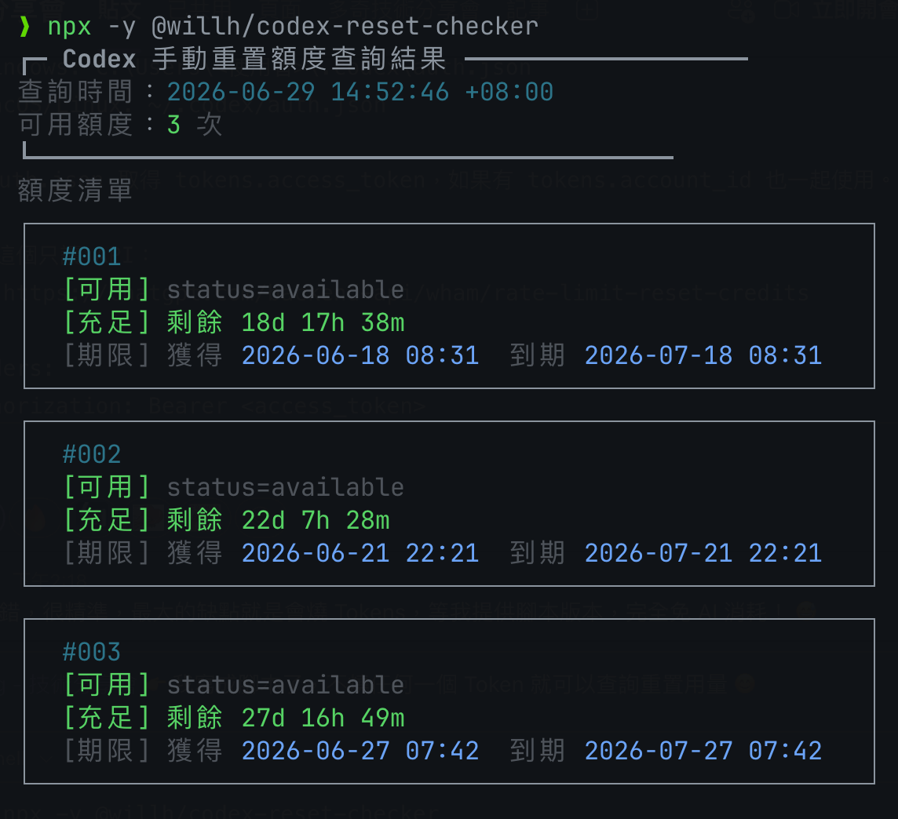

# Codex 額度查詢工具

## 專案介紹

這是用來查詢 Codex/ChatGPT 使用額度與手動重置額度的 CLI 工具，重點在於快速取得目前額度資訊。

工具會讀取本機 Codex 登入資訊中的存取權杖，呼叫 ChatGPT 後端取得以下兩類資料：

- `使用額度`：目前工作階段、每週視窗，以及 API 有提供時的模型專用額度之已使用比例、剩餘比例及重置倒數。
- `手動重置額度`：可用次數，以及每筆額度的取得時間、到期時間與剩餘時間。

一般查詢不會修改本機檔案。只有明確使用 `--ics` 時才會建立行事曆檔案；任何模式都不會輸出 `access_token` 或 `account_id`。

快速開始：

```bash
npx @willh/codex-reset-checker
```



* * *

## 目錄

- [1. 檔案結構](#1-檔案結構)
- [2. 安裝方式](#2-安裝方式)
- [3. CLI 使用方式](#3-cli-使用方式)
- [4. 執行畫面](#4-執行畫面)
- [5. auth.json 來源與欄位](#5-authjson-來源與欄位)
- [6. API Header 規格](#6-api-header-規格)
- [7. 輸出欄位與格式](#7-輸出欄位與格式)
- [8. 錯誤處理](#8-錯誤處理)
- [9. 時間轉換規則](#9-時間轉換規則)
- [10. 發佈到 npm](#10-發佈到-npm)
- [11. 安全與隱私原則](#11-安全與隱私原則)

* * *

## 1. 檔案結構

```text
.
├─ bin/
│  └─ codex-reset-checker.js      Node.js CLI 主程式
├─ lib/
│  └─ ics.js                      iCalendar 複選、產生與匯出共用模組
├─ assets/
│  └─ codex-reset-checker-screenshot.png
├─ test/
│  └─ codex-reset-checker.test.js  CLI 與回應解析測試
├─ package.json
└─ README.md
```

* * *

## 2. 安裝方式

### 從 npm 安裝（建議）

```bash
npm install -g @willh/codex-reset-checker
```

### 本機直接使用

```bash
npm install
```

* * *

## 3. CLI 使用方式

### 全域安裝後直接執行

```bash
codex-reset-checker
```

### 指定 `auth.json` 路徑

```bash
codex-reset-checker --auth /path/to/auth.json
# 或
codex-reset-checker /path/to/auth.json
```

### 輸出 JSON

```bash
codex-reset-checker --json
codex-reset-checker --auth /path/to/auth.json --json
```

`--json` 會在保留手動重置 API 原始欄位的前提下，輸出單行 JSON。輸出會新增標準化的 `usage` 欄位，並以 `usage_raw` 保留 `/wham/usage` 的原始回應，適合交給其他工具處理。使用額度查詢失敗時，`usage` 會是 `null`，並新增 `usage_error`；警告會輸出至標準錯誤，不混入 JSON 標準輸出。

### 匯出 iCalendar

```bash
codex-reset-checker --ics
codex-reset-checker --ics --output ./codex-reset-reminders.ics
codex-reset-checker --auth /path/to/auth.json --ics
```

`--ics` 會列出狀態為 `active` 或 `available`、時間可解析且尚未到期的手動重置額度。使用方向鍵移動，按 `Spacebar` 複選，按 `Enter` 匯出，或按 `q`、`Esc` 取消。清單預設不勾選任何項目。

每筆選取額度會在同一個 `.ics` 檔建立一筆期間事件。事件從原始 `expires_at` 往前 72 小時開始，並於 `expires_at` 結束；描述保留 `status`、`granted_at`、原始 `expires_at` 與事件開始時間。未指定 `--output` 時，檔案會建立在目前工作目錄，名稱格式為 `codex-reset-credits-YYYYMMDD-HHmmss.ics`。

程式不會覆寫既有檔案。寫入成功後會自動開啟檔案所在資料夾；若作業系統無法開啟資料夾，檔案仍會保留並顯示警告。`--ics` 只能在互動式終端機使用，且不能與 `--json` 或 `--watch` 同時使用。

### 持續監看

```bash
codex-reset-checker --watch
codex-reset-checker -w
codex-reset-checker --auth /path/to/auth.json --watch
```

監看模式啟動時會先清空畫面並立即查詢，之後每 60 秒自動清空畫面再刷新一次。標頭會顯示目前方案與方案到期時間；最下方的操作提示列會每秒更新下次自動刷新的倒數秒數。終端機的欄數或列數變更時也會立即重新整理版面；因此調整視窗大小或字體大小造成可用欄列數變化時，畫面會自動重繪。連續的尺寸變更會經過短暫防抖，查詢尚未完成時則延後至上一輪結束，避免輸出互相穿插。

按下 `Spacebar` 可立即刷新，並將下次自動刷新重設為 60 秒後；查詢期間會保留現有畫面，等新資料就緒後才重繪，避免畫面先清空所造成的閃爍。按下 `q` 或 `Ctrl+C` 可結束監看模式。畫面最後一行會持續顯示操作提示與刷新倒數。若單次刷新失敗，錯誤會顯示於畫面上，程序仍會等待下一次定時刷新或終端機尺寸變更。

### 不安裝直接執行

```bash
node ./bin/codex-reset-checker.js
node ./bin/codex-reset-checker.js --auth /path/to/auth.json
node ./bin/codex-reset-checker.js --json
```

### 從 npm 一次性執行

```bash
npx @willh/codex-reset-checker
```

### 在 Windows 使用 PowerShell 或 CMD

```powershell
codex-reset-checker
```

> 注意：如需指定 `auth.json` 路徑，請改用自己環境的實際檔案位置。

* * *

## 4. 執行畫面


* * *

## 5. auth.json 來源與欄位

本工具會讀取本機登入資訊：

- macOS/Linux 預設：`~/.codex/auth.json`
- Windows 預設：`C:\Users\<使用者>\.codex\auth.json`

只會使用以下欄位：

- `tokens.access_token`（必要）
- `tokens.account_id`（可選，有才放入 request header）

若缺少 `tokens.access_token`，程式直接退出並顯示錯誤訊息，不會送出 API 請求。

* * *

## 6. API Header 規格

| Header 名稱 | 值 |
| --- | --- |
| `Authorization` | `Bearer <access_token>` |
| `OpenAI-Beta` | `codex-1` |
| `originator` | `Codex Desktop` |
| `ChatGPT-Account-ID` | `<account_id>`（若存在才加入） |

請求方法：`GET`

請求 URL：

- 手動重置額度：`https://chatgpt.com/backend-api/wham/rate-limit-reset-credits`
- 使用額度：`https://chatgpt.com/backend-api/wham/usage`

其中 `/wham/usage` 是 ChatGPT 後端的非公開端點，僅依目前 Codex 用戶端可觀察到的回應格式解析。GPT-5.3-Codex-Spark 只有在帳號與當次回應包含相應的 `additional_rate_limits` 時才會顯示，不會從一般額度推算 Spark 用量。

* * *

## 7. 輸出欄位與格式

終端機輸出分成 `使用額度` 與 `手動重置額度` 兩個區段。

使用額度會解析 `/wham/usage` 回應中的 `rate_limit` 與 `additional_rate_limits`：

- `primary_window`：目前工作階段。
- `secondary_window`：每週額度。
- `additional_rate_limits`：額外的模型專用額度；包含 GPT-5.3-Codex-Spark 時，會顯示其目前工作階段與每週額度。
- `used_percent`：已使用百分比。
- `remaining_percent`：依 `100 - used_percent` 計算的剩餘百分比。
- `limit_window_seconds`、`reset_after_seconds`、`reset_at`：視窗與重置資訊；缺少或無法解析時顯示 `N/A`。

手動重置額度保留原有欄位：

- `available_count`
- 每筆 `credit` 的 `granted_at`
- 每筆 `credit` 的 `expires_at`
- 每筆 `credit` 的 `status`
- `expires_at` 會同時附上精簡剩餘時間（例如：`剩餘 2d 3h 20m`、`到期已過 10m`）

使用額度會以框線表格卡片呈現：剩餘百分比、已使用比例、Progress Bar 與重設時間會放在同一張卡片內。CLI 會讀取目前終端機的欄數，寬度足夠時使用兩欄，寬度不足時自動改為單欄；標頭與使用額度卡片會共用相同的總寬度，且最大不超過「手動重置額度」的實際版面寬度。

輸出範例：

```text
╭────────────────────────────────────────────╮
│             Codex 額度查詢 (v0.5.0)         │
│ 查詢時間：2026-06-29 14:00:00 +08:00       │
╰────────────────────────────────────────────╯
使用額度
╭────────────────────────────────────────────╮
│ 5 小時使用情況限制                         │
│ 58% 剩餘 ・已使用 42%                       │
│ ████████████████░░░░░░░░                   │
│ 重設時間 約 2h 15m 後重設                  │
╰────────────────────────────────────────────╯
╭────────────────────────────────────────────╮
│ 每週用量上限                               │
│ 82% 剩餘 ・已使用 18%                       │
│ ███████████████████████░░░░░               │
│ 重設時間 約 4d 8h 後重設                   │
╰────────────────────────────────────────────╯
╭────────────────────────────────────────────╮
│ GPT-5.3-Codex-Spark 5 小時使用情況限制     │
│ 88% 剩餘 ・已使用 12%                       │
│ █████████████████████████░░░               │
│ 重設時間 約 2h 後重設                      │
╰────────────────────────────────────────────╯
╭────────────────────────────────────────────╮
│ GPT-5.3-Codex-Spark 每週用量上限           │
│ 92% 剩餘 ・已使用 8%                        │
│ ██████████████████████████░░               │
│ 重設時間 約 3d 後重設                      │
╰────────────────────────────────────────────╯

手動重置額度
┌────────────────────────────────────────────────────────┐
│ #001                                                   │
│ [可用] status=active 仍在有效                         │
│ [充足] 剩餘 7d 0h 0m                                │
│ [期限] 獲得 2026-06-29 12:03  到期 2026-07-06 12:03  │
└────────────────────────────────────────────────────────┘
┌────────────────────────────────────────────────────────┐
│ #002                                                   │
│ [可用] status=active 仍在有效                         │
│ [充足] 剩餘 14d 0h 0m                               │
│ [期限] 獲得 2026-06-29 12:03  到期 2026-07-13 12:03  │
└────────────────────────────────────────────────────────┘
```

無資料時：

```text
╭────────────────────────────────────────────╮
│             Codex 額度查詢 (v0.5.0)         │
│ 查詢時間：2026-06-29 14:00:00 +08:00       │
╰────────────────────────────────────────────╯
使用額度
╭────────────────────────────────────────────╮
│ 5 小時使用情況限制                         │
│ N/A 剩餘 ・已使用 N/A                      │
│ ────────────────────────────               │
│ 重設時間 未提供                            │
╰────────────────────────────────────────────╯
╭────────────────────────────────────────────╮
│ 每週用量上限                               │
│ N/A 剩餘 ・已使用 N/A                      │
│ ────────────────────────────               │
│ 重設時間 未提供                            │
╰────────────────────────────────────────────╯

手動重置額度
```

JSON 輸出範例：

```json
{"available_count":2,"credits":[{"granted_at":"2026-06-29T04:03:15Z","expires_at":"2026-07-06T04:03:15Z","status":"active"}],"usage":{"primary_window":{"name":"目前工作階段","used_percent":42,"remaining_percent":58,"limit_window_seconds":18000,"reset_after_seconds":8100,"reset_at":1762147153},"secondary_window":{"name":"每週額度","used_percent":18,"remaining_percent":82,"limit_window_seconds":604800,"reset_after_seconds":345600,"reset_at":1762650589},"additional_rate_limits":[{"id":"codex-spark","name":"GPT-5.3-Codex-Spark","primary_window":{"name":"目前工作階段","used_percent":12,"remaining_percent":88,"limit_window_seconds":18000,"reset_after_seconds":7200,"reset_at":1762143553},"secondary_window":{"name":"每週額度","used_percent":8,"remaining_percent":92,"limit_window_seconds":604800,"reset_after_seconds":259200,"reset_at":1762391653}}]},"usage_raw":{"plan_type":"pro","rate_limit":{"primary_window":{"used_percent":42,"limit_window_seconds":18000,"reset_after_seconds":8100,"reset_at":1762147153},"secondary_window":{"used_percent":18,"limit_window_seconds":604800,"reset_after_seconds":345600,"reset_at":1762650589}},"additional_rate_limits":[{"limit_name":"codex-spark","primary_window":{"used_percent":12,"limit_window_seconds":18000,"reset_after_seconds":7200,"reset_at":1762143553},"secondary_window":{"used_percent":8,"limit_window_seconds":604800,"reset_after_seconds":259200,"reset_at":1762391653}}]}}
```

`usage_raw` 會保留使用額度端點的原始回應，避免標準化欄位遺失後端未來新增的資料。手動重置端點的原始欄位則直接保留在 JSON 頂層。

額度視窗名稱會依 `limit_window_seconds` 判定，不會將 `primary_window` 固定視為 5 小時額度。若後端只回傳 604800 秒的 `primary_window` 且 `secondary_window` 為 `null`，終端會只顯示「每週用量上限」；`usage_raw` 仍完整保留原始欄位位置。

* * *

## 8. 錯誤處理

常見錯誤訊息（不會洩漏敏感值）：

- `錯誤：找不到 auth.json：<path>`
- `錯誤：auth.json 內未找到 tokens.access_token`
- `錯誤：讀取或解析 auth.json 失敗：...`
- `錯誤：請求 API 失敗，HTTP 401 Unauthorized...`
- `錯誤：請求 API 失敗，HTTP 403 Forbidden...`
- `警告：使用額度查詢失敗，仍顯示手動重置額度。...`
- `錯誤：--ics 需要互動式終端機`
- `錯誤：輸出檔案已存在，未覆寫：<path>`
- `警告：無法自動開啟輸出資料夾。...`

手動重置額度查詢失敗時，程式會以非零狀態退出。使用額度查詢是附加流程；若該端點收到 401、429、5xx 或回應格式無法解析，程式仍會顯示手動重置額度。`--json` 模式會以 `usage: null` 與 `usage_error` 表示這個狀態。

若收到 401/403，多半是 Token 過期、登入權限問題或會話已失效，請先在 Codex 端重新登入，確認 `~/.codex/auth.json` 已更新。錯誤回應中的 Token 與帳號識別值會遮罩，不會輸出。

* * *

## 9. 時間轉換規則

`granted_at` 與 `expires_at` 會依本機時區輸出：

- 查詢時間格式：`yyyy-MM-dd HH:mm:ss +HH:MM`
- `granted_at` 與 `expires_at` 格式：`yyyy-MM-dd HH:mm`
- 失敗解析時保留原始值，不中斷輸出
- `使用額度` 以 `reset_at` 計算距離重置的倒數；若缺少 `reset_at`，改用 `reset_after_seconds`
- `usage_raw` 與手動重置資料在 `--json` 模式保留 API 原始值
- `.ics` 事件使用 UTC；`DTSTART` 為 `expires_at - 72 小時`，`DTEND` 為原始 `expires_at`

* * *

## 10. 發佈到 npm

### GitHub Actions 自動發佈

專案使用 npm Trusted Publishing 與 GitHub Actions OIDC 發佈，不需要建立或保存 `NPM_TOKEN`。

首次發佈前，在 npm 套件的 Trusted Publisher 設定中填入：

| 欄位 | 設定值 |
| --- | --- |
| Organization or user | `doggy8088` |
| Repository | `codex-reset-checker` |
| Workflow filename | `ci.yml` |
| Environment name | 留白 |
| Allowed actions | `npm publish` |

發佈流程：

1. 將 `package.json` 的版本提升為新版本。
2. 將變更合併或推送至 `main`。
3. `.github/workflows/ci.yml` 會先完成所有 Node.js 版本的 CI，然後將 npm 更新至最新版本。
4. 工作流程透過 OIDC 將套件發佈到 npm registry，再自動發佈 `v<package.json version>` GitHub Release。
5. GitHub Release 的發行記錄會彙整前一個 Git tag 至目前 `main` 提交的 git log 摘要。

CI 會在 `main` 的 push 與所有 pull request 上，使用 Node.js 14、18、20、22 與 24 執行測試及 `npm pack --dry-run`。只有 `main` push 會執行 npm 發佈與 GitHub Release；pull request 僅執行 CI。

每次推送新提交至 `main` 前都必須先提升 `package.json` 版本。若同版本 tag 已指向舊提交，Release job 會失敗，不會覆寫現有 tag 或 Release。

建議發佈前確認：

- `name` 為 `@willh/codex-reset-checker`
- `bin.codex-reset-checker` 指向 `bin/codex-reset-checker.js`
- `bin/codex-reset-checker.js` 有執行權限（若以直接執行）
- npm Trusted Publisher 的工作流檔名與 `ci.yml` 完全相同

* * *

## 11. 安全與隱私原則

- 不安裝任何非必要套件
- 一般查詢不修改本機檔案；只有 `--ics` 會寫入使用者指定或目前工作目錄中的行事曆檔案
- 不輸出 `access_token` 或 `account_id`
- 只讀取本機 `auth.json`
- 除使用者要求的 `.ics` 外，無資料持久化、無快取、無遙測

`/wham/usage` 並非 OpenAI 公開 API，回應格式、權限與可用性可能變更。這項功能顯示的是 Codex 工作階段與週期的使用額度，不宣稱為可購買 Credits 的餘額。OpenAI 官方目前說明可在 ChatGPT 的 Codex Settings > Usage Dashboard 查看 Credits 餘額，未提供本工具可依賴的公開 Access Token API：[Using Credits for Flexible Usage in ChatGPT](https://help.openai.com/en/articles/12642688-using-credits-for-flexible-usage-in-chatgpt-plus-pro)。
